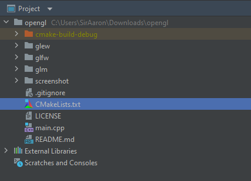

One day I decided to learn more about game engines and rendering in general. Having some prior knowledge, I decided to start at OpenGL, at a [website](https://learnopengl.com/) I was intimately familiar with since university - called learnopengl. 
The process of getting started seemed easy enough by just glancing through it, but the day was about to go very wrong indeed. 

# Disclaimer
I am a c++ noob - that means I have some knowledge of using c++ for a university project, and that's the language I started programming with. However, I do not have much (if any) knowledge of setting up libraries, static linking, c++ toolchains, make/cmake, header only stuff, and how it all differs between Linux vs. Windows.
That means my story is from the point of view of a total newbie in (what one could say) professional c++ development.

I also do not have all the artifacts that were created along this journey, but the final working result will be visible at the end of the post.

# The objective
I wanted to kick off my OpenGL studies by creating a simple hello world program for OpenGL, but there are a few alternations I wanted to make:
- I do not wish to use Visual Studio or anything similar. Instead I wanted to use Jetbrains Clion (Jetbrains IDEs are generally way more user-friendly, with better code navigation features)
- I want the project to be kind of self-contained - in other words, I want a seed project that I can replicate and use in other OpenGL if I so wish
- I do not wish to be manually adding/linking libraries or downloading stuff to put in some weird directory on my machine. I want to be able to delete the project when I don't need it and all related stuff to be gone

By achieving this, I felt like it would be a more professional approach that one might find at a job (I'm not sure if that's true, though). The website mentioned that compiling necessary libraries guarantees that everything will work on my machine.
And just by my personal preference - I do not like downloading random libraries that later sit around on my machine in a folder I never dare to look in.

## Attempt 1
Let's kick it off simple:
1. install Clion
2. Clion uses Cmake
3. Try to find a Cmake command that lets you hook up OpenGL
4. Opengl doesn't work

More or less, I used:

```
find_package(OpenGL REQUIRED)
```

Even without linking it yet, that command would fail:

```
CMake Error at ../Modules/FindPackageHandleStandardArgs.cmake:108 (message): Could NOT find OpenGL (missing: OPENGL_gl_LIBRARY OPENGL_INCLUDE_DIR) Call Stack (most recent call first):
../Modules/FindPackageHandleStandardArgs.cmake:315 (_FPHSA_FAILURE_MESSAGE)
../Modules/FindOpenGL.cmake:161 (FIND_PACKAGE_HANDLE_STANDARD_ARGS)
../CMakeLists.txt:196 (find_package)
```

So it was time to go on StackOverflow and Google...
... but the first two pages of google surprisingly didn't yield any results. 

There was a lot of information about downloading drivers or workarounds that somehow by downloading some seemingly unrelated tool, things started working again. But the overall experience was that StackOverflow was the most unhelpful it has ever been to me.

It is worth mentioning that many online tutorials either make you download just the binaries and attach them to your project or generally use VisualStudio, which has a .sln project file generated through externally downloaded cmake. I did not wish to download another cmake as I have one already bundled with Clion. I did not want to give in to Visual Studio as I knew it would be a lot of pain.

## Attempt 5
Along a few not mentioned attempts, I tried random stuff, and at some point, I read a line from the [website](https://learnopengl.com/Getting-started/OpenGL):

```
Before starting our journey, we should first define what OpenGL is. OpenGL is mainly considered an API (an Application Programming Interface) that provides us with many functions that we can use to manipulate graphics and images. However, OpenGL is not an API but merely a specification developed and maintained by the Khronos Group.

The OpenGL specification specifies the result/output of each function and how it should perform. It is then up to the developers implementing this specification to develop a solution of how this function should operate. Since the OpenGL specification does not give us implementation details, the actually developed versions of OpenGL are allowed to have different implementations. Their results comply with the specification (and are thus the same to the user).
```

So it may be that I have a specification only and no implementation? But now, I have updated Nvidia drivers, which to my knowledge should include OpenGL. That let me do more digging, and I found that I need something called [GLFW](https://www.glfw.org/). 
At this point, I thought to myself that maybe I am missing some pieces actually to be able to develop using OpenGL.

I try to find_package with GLFW after downloading it, but I initially put it after the 
```
find_package(OpenGL REQUIRED)
```
which obviously didn't help. I swapped things around and received a different error.
Now for some reason, cmake couldn't find... X11???:

```
Could NOT find X11 (missing: X11_X11_INCLUDE_PATH X11_X11_LIB)
```

Quickly googling X11 confirmed that I wasn't daydreaming and that finding glfw somehow required an X11 server, which is like a window protocol from Linux??? But I am on windows?
I downloaded all the libraries again, making double sure that I got Windows x64 versions and not some Linux ones by mistake. But the error remained.

This resulted in me giving up for the night.

## Attempt 6
The next day I decided not to give up on OpenGL so quickly and that there has to be some explanation.

I went over the same tutorials repeatedly trying to find a clue about what I was doing so wrong that stack and google are unable to help me. At one point, I noticed that some tutorials explicitly mentioned using MinGW. I went to Clion project settings to check my toolchain, and I found ... Cygwin.

[cygwin](https://www.cygwin.com/):

```
Cygwin is:

a large collection of GNU and Open Source tools which provide functionality similar to a Linux distribution on Windows.
a DLL (cygwin1.dll) which provides substantial POSIX API functionality.
```

[mingw](https://en.wikipedia.org/wiki/MinGW):

```
MinGW ("Minimalist GNU for Windows"), formerly mingw32, is a free and open-source software development environment to create Microsoft Windows applications. The development of the MinGW project has been forked with the creation in 2005–2008 of an alternative project called Mingw-w64.

MinGW includes a port of the GNU Compiler Collection (GCC), GNU Binutils for Windows (assembler, linker, archive manager), a set of freely distributable Windows specific header files and static import libraries which enable the use of the Windows API, a Windows native build of the GNU Project's GNU Debugger, and miscellaneous utilities.
``` 

I still don't quite get the exact difference between the two, but apparently, they are different enough toolchains that it could indeed break something.

Changing my project setting from Cygwin to Mingw resulted in Cmake actually finding OpenGL and GLFW hurraaay.

## Attempt 7
This was ... not quite the end of my struggles.
I have made significant progress in writing a working hello world for OpenGL, having taken some code from [here](http://www.opengl-tutorial.org/beginners-tutorials/tutorial-1-opening-a-window/)

I now realised that I have a problem with a lack of implementations even though C++ is not complaining about their declarations.

```
====================[ Build | myapp-clion | Debug ]=============================
..\AppData\Local\JetBrains\Toolbox\apps\CLion\ch-0\212.5080.54\bin\cmake\win\bin\cmake.exe --build ..\LearnOpenGL-CLion-master\cmake-build-debug --target myapp-clion -- -j 6
[ 88%] Built target glfw
[ 94%] Linking CXX executable myapp-clion.exe
CMakeFiles\myapp-clion.dir/objects.a(main.cpp.obj): In function `initGL':
../LearnOpenGL-CLion-master/main.cpp:8: undefined reference to `__imp_glMatrixMode'
../LearnOpenGL-CLion-master/main.cpp:9: undefined reference to `__imp_glLoadIdentity'
../LearnOpenGL-CLion-master/main.cpp:10: undefined reference to `__imp_glOrtho'
../LearnOpenGL-CLion-master/main.cpp:11: undefined reference to `__imp_glMatrixMode'
../LearnOpenGL-CLion-master/main.cpp:12: undefined reference to `__imp_glLoadIdentity'
```

And many other similar issues. That lead me to find out that I might need something called [glew](http://glew.sourceforge.net/).

At this point, my project structure started looking like this:

  
where glew, glfw and glm were the libraries' GitHub repositories.

## Attempt 10
By this time, I realised that GLM and GLFW had their own CMakeLists.txt files as they were cmake projects. This made including them in my project way more manageable. However, GLEW on the official [site](http://glew.sourceforge.net/)
was not. This was an issue because I didn't want to start learning OpenGL by learning cmake and how to include/make projects in it. I was lucky enough to find a maintained cmake version of glew [here](https://github.com/Perlmint/glew-cmake), and I have been using it since then.

Few attempts later and a lot of random going back and forth between various ways to link/include libraries in cmake to make sure that they are being built I ended up with this CMakeLists.txt:
```
cmake_minimum_required(VERSION 3.20)
project(myapp-clion)

# Including GLFW
add_subdirectory(glfw)
include_directories(glfw/include)

# Including GLEW
add_subdirectory(glew)
include_directories(glew/include)

# Including GLM
add_subdirectory(glm)
include_directories(glm/glm)

find_package(OpenGL REQUIRED)

add_executable(myapp-clion main.cpp)

target_link_libraries(myapp-clion glfw ${GLEW_TARGETS} glm)

```

This still was not working, but I realised that what I input into target_link_libraries should be a project name defined in CMakeLists.txt of a specific project and not a directory name. GLFW and GLM followed the convention of having target names glfw and glm, respectively, while GLEW had a rather big variable called GLEW_TARGETS, which frankly seemed like a good choice - but it wasn't.
Some digging later, I found that there is also libglew_static defined there, and I decided to include that. Finally, everything started working.

# Final result
The final, working cmake:
```
cmake_minimum_required(VERSION 3.20)
project(myapp-clion)

# Including GLFW
add_subdirectory(glfw)
include_directories(glfw/include)

# Including GLEW
add_subdirectory(glew)
include_directories(glew/include)

# Including GLM
add_subdirectory(glm)
include_directories(glm/glm)

find_package(OpenGL REQUIRED)

add_executable(myapp-clion main.cpp)

target_link_libraries(myapp-clion glfw libglew_static glm)
```

# Conclusions/TLDR
A working seed project for:
- Clion
- Windows 10 x64 bit
- MinGW x64
- Cmake
- With GLFW, GLM and GLEW

Can be found [on my github](https://github.com/RobPiwowarek/OpenGL_Seed_Project)

This whole ordeal with setting up a project which should take like 10 minutes (setting up a project in java would take about this long, IMHO) took me two days. There is a lot of stuff that can go wrong while doing even a simple thing like that, and together with my lack of knowledge about the ecosystem of c++, toolchains, etc. made me remember [a talk I really liked from Jonathan Blow](https://youtu.be/ZSRHeXYDLko), which I recommend.
"Preventing the Collapse of Civilization" where he mentions how we are starting to lose knowledge about what stuff is going on underneath all the abstraction we have built and got familiar with using - which resulted in people creating worse and worse software.

My little adventure made me feel like I have improved as a coder in the last 3-4 years of my career. Before, I think I would have given up, but now I was able to finish the thing I set off to do.

# Alternative solutions I found along the way
Loosely related to my adventure, I have found two alternative solutions that might help someone who is having similar issues with setting up OpenGL projects.

## Package Managers
Visual Studio has something called [NuGet](https://www.nuget.org/), which is something like a Maven for java projects that allows you to download packages for GLM, GLFW, GLEW, etc. And generally probably should work out of the box.

There is also another package manager called [Hunter](https://hunter.readthedocs.io/en/latest/), which is a Cmake-based package manager that also includes the aforementioned libraries.

Why haven't I used them? The pride, I guess, at this point, I wanted to learn how to link the libraries myself instead of relying on a package manager.

## Custom Paths in Cmake modules
I heard from a friend that he encountered a similar problem while developing on Ubuntu many years ago. His solution that seemed to work was adding custom FindOpenGL etc., scripts to Cmake to explicitly give them a path to look for the libraries.
I'm unsure if the problem is still relevant, but since I learned about it, I'm leaving a link to his [github](https://github.com/Grushenko/GLPress) repository if anyone ever needs an example of this.
```
set(CMAKE_MODULE_PATH ${CMAKE_MODULE_PATH} "${CMAKE_SOURCE_DIR}/cmake/modules/")
```
Would be the relevant line in CMakeLists.txt
